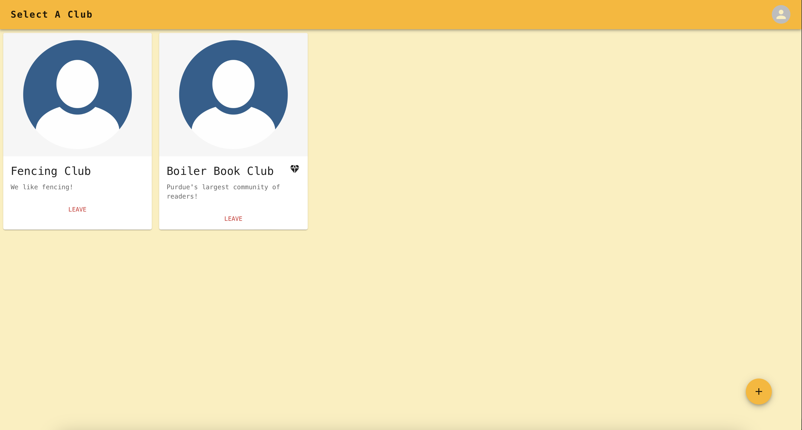
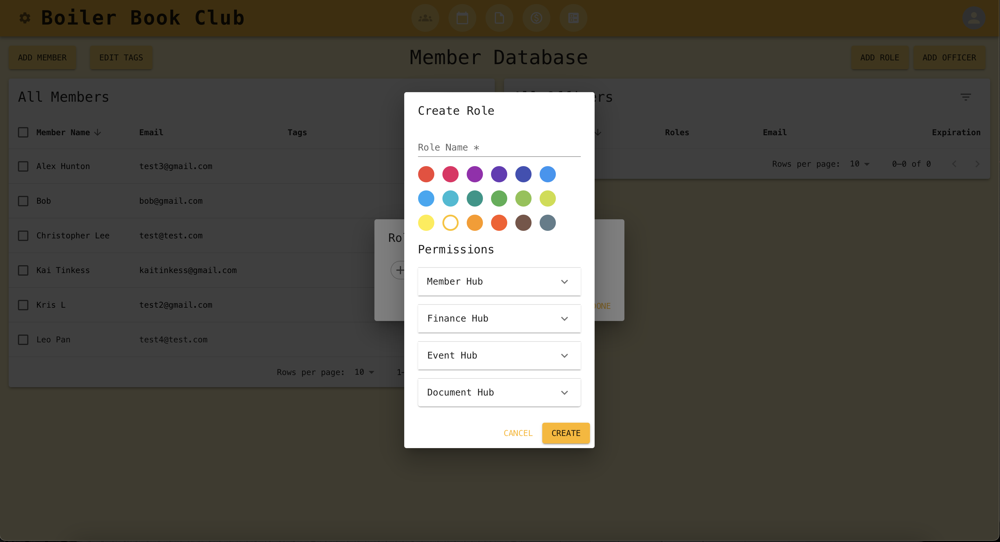
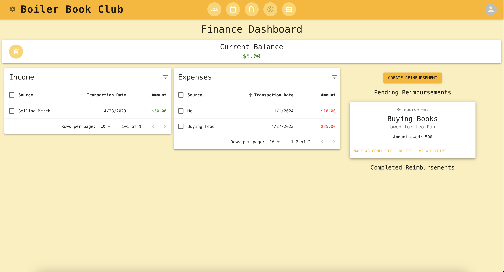
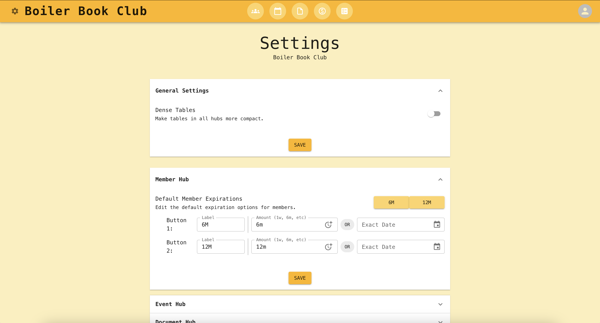

# Clava

Clava is a management software targeted at college organizations. It offers a suite of utilities for their most common needs:
- A role based permission system for Officers
- An advanced Member database and editor
- A financial hub for income/expense tracking with reimbursement support
- An event manager with attendance tracking through generated QRs
- A centralized documentation system with Google Drive and YouTube integration

Additionally, Clava also offers an alternative frontend in the form of Discord integration, with servers being allowed to link themselves to a club. Various hubs can be accessed and edited through slash commands.

## Background

Originally designed by students of Purdue University for CS307, most Purdue clubs previously used BoilerLink, which was offered directly by Purdue. Unfortunately, BoilerLink's primary purpose was to centralize club information and enforce
the school's requirements. Although not inherently a bad thing, it meant that it was difficult to effectively
use on a day-to-day basis.

Beyond just Purdue, most college clubs and organizations do not have a centralized system in which general information, member data, and funds are managed. This 
directly impacts their ability to effectively operate by increasing the amount 
of time it takes to complete basic tasks, such as granting individual 
permissions or providing reimbursements. Clava offers a solution to this.

---

## High Level Overview

Clava is a MERN app developed with a frontend React application that, using HTTPS requests, communicates with a RESTful API running on an ExpressJS Node server. Information is stored in a MongoDB database that is interfaced with using Mongoose. More information is available in our Design Document, located in `/docs`.

## Installation
1. Clone this repository: `git clone https://github.com/erakai/Clava.git`.
2. In both the `client` and `server` folders:
   1. Run `npm install`.
   2. In server, run `cp .env.example .env` and update the relevant information.
3. If you wish to develop, install the PostCSS, ESLint, and Prettier plugins.
4. Install [MongoDB](https://www.mongodb.com) and make sure it is running. You can additionally download MongoDB Compass to view the database using a GUI.
5. Start the server and then the client with `npm start`.

## Developers
- Kai Tinkess
- Alex Hunton
- Christopher Lee
- Leonard Pan
- Kris Leungwattanakij

## Screenshots

